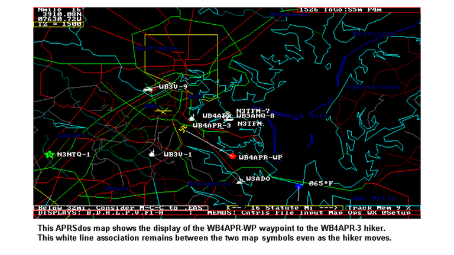

% APRS Turns 35. What's Next?
% Ray Rischpater, KF6GPE kf6gpe@arrl.net | kf6gpe.org  
% BayCon, 9 February 2019

# The Automated Packet Reporting System...

*  Was developed by Bob Bruniga, WB4APR beginning in 1984
*  Is a packet format for the exchange telemetry, messages, and position over amateur radio
*  Uses primarily AFSK ("packet radio") on 2m (144.390 MHz in the US)
*  Is widely used for tactical work in public service 

# What can you do?

*  Share position information with other stations
*  Obtain local weather conditions
*  Short text messaging between stations or to SMS or email
*  Satellite operations through the ISS or cubesats

# Then...

# And now!

# Some portable stations then & now

# In the field

# Mobile

# Satellite

# The APRS network

# A word about the internet...

#  Getting on the air
## What you need

*  Software for Windows, Mac, Linux, iOS or Android
*  A PC, tablet, or cell phone (portable is fun!)
*  A 2m radio
*  TNC or soft modem cable for your radio
*  (Optional) GPS receiver

# Terminology

*  _Callsign_ - Your callsign
*  _SSID_ - A unique integer from 1-15 to identify your station
*  _Icon_ - An icon identifying your station on the map
*  _Digipeater_ - A station that repeats (digipeats) packets
*  _IGate_ - A station configured to route packets to (and possibly from) the Internet

# Frequencies

*  144.390 MHz - National Simplex APRS Frequency
*  145.825 MHz - Satellite uplink / downlink

# Software
*  APRSIS32 - Windows, very full featured
*  PinPointAPRS - Windows, good UI, best for monitoring 
*  YAAC - Java, all platforms, a bit fiddly 
*  APRSdroid - Android
*  PocketPacket - iOS & Mac OS

# Older software
### You'll see these, don't bother trying with them!
*  UIView-32
*  MacAPRS & WinAPRS
*  javAPRS (for embedding in a Web browser)

# Radios

*  Kenwood TH-D7A, TH-D72A (GPS), TH-D74A (GPS, D-STAR, & Bluetooth)
*  Kenwood TH-D700, TH-D710
*  Yaesu VX-8DR, FT1DR, FT2DR
*  PicoAPRS mini-APRS Transceiver
*  Any other 2m radio connected to a Mobilinkd Bluetooth TNC

# Connecting to the network

*  Bluetooth
*  USB (and USB-to-serial)
*  Sound modem
*  TCP/IP

# Bluetooth

*  Low-power, wireless protocol for audio and serial
*  Bluetooth Serial replaces RS-232 or USB serial
*  Works with some KISS TNCs (Moblinkd, Kenwood TH-D74A/E)
*  Great choice for portable with Android smartphones
*  Can work with Windows, but expect weird problems.
*  Not possible under iOS at present

# USB

*  Serial connections for the new millennium
*  Some TNCs and radios have USB
*  Others will require a USB-RS232 adapter
*  Drivers for USB-RS232 can be fussy!
*  Works with Windows, Linux, Mac OS X, Android (maybe)

# Sound modem

*  Uses the sound card in your computer or an external adapter like a TigerTronics SignaLink.
*  PC, Mac and Linux need software (Direwolf, AGWPE, others)
*  Can be tricky to set up (not all APRS apps work with all sound modem apps)

# Sound modems and cell phones

*  APRSdroid and PocketPacket include sound card modem software!
*  Just hold your phone next to your radio...
*  ...or make a cable and use VOX

# TCP/IP

*  Used as backhaul to APRSIS
*  Most APRS clients support this today
*  Generally does _not_ transmit your telemetry to the RF network.
*  A great choice for learning on your cell phone!

# Setting up

*  Call sign and SSID
*  Icon (funky codes abound!)
*  Digipeater path (stick with WIDE1-1)

# Station setup - APRSIS32

# Beaconing setup - APRSIS32

# Port setup - APRSIS32 

# It looks complicated...
## But it isn't.
Most apps have a setup wizard. Know your callsign, SSID, passcode, and TNC port before you begin.

# Setting up for APRSIS access

* You need a callsign and a passcode to transmit on APRS-IS.
* The passcode is generated from your callsign. It's semi-secret.
* You can get the passcode from any APRS software author, or some hams.

# Setting up internet gating
* You'll need your callsign and passcode (you're accessing APRSIS after all!)
* Most APRS applications support Internet Gating; check the settings.
* Do _not_ blindly transmit the APRSIS feed to the RF network. You'll swamp the channel!

# Starting with your cell phone

*  Download APRSdroid or PocketPacket
*  Enter configuration
(do demo)

#  APRS software links

* [APRSdroid](https://aprsdroid.org/), [APRSdroid on the Play Store](https://play.google.com/store/apps/details?id=org.aprsdroid.app)
* [PocketPacket iOS](http://koomasi.com/pocketpacket/), [Pocket Packet on the App Store](https://itunes.apple.com/us/app/pocketpacket/id336500866?mt=8)
* [PocketPacket Mac OS](http://koomasi.com/pocketpacket-mac-os/), [Pocket Packet on the Mac App Store](https://itunes.apple.com/us/app/pocketpacket/id434074502?mt=12)
* [APRSIS32](http://aprsisce.wikidot.com/)
* [PinPointAPRS](http://www.pinpointaprs.com/)
* [YAAC](http://www.ka2ddo.org/ka2ddo/YAAC.html)
* [Xastir](http://www.xastir.org)

# Sound card modem links

* [AGWPE Resources](https://www.soundcardpacket.org/)
* [Packet Engine Pro](https://www.sv2agw.com/ham/pepro.htm)
* [UZ7HO](http://uz7.ho.ua/packetradio.htm)

# Protocol & implementation links

* [APRS Protocol Specification](http://www.aprs.org/doc/APRS101.PDF)
* [APRS Internet Service](http://www.aprs-is.net/)
* [Python APRS Module](https://github.com/ampledata/aprs) (one of many!)
* [pyaprs-stationservice](https://github.com/kf6gpe/pyaprs-stationservice) Python Web service to monitor APRS-IS feed and provide REST interface to report station positions. 