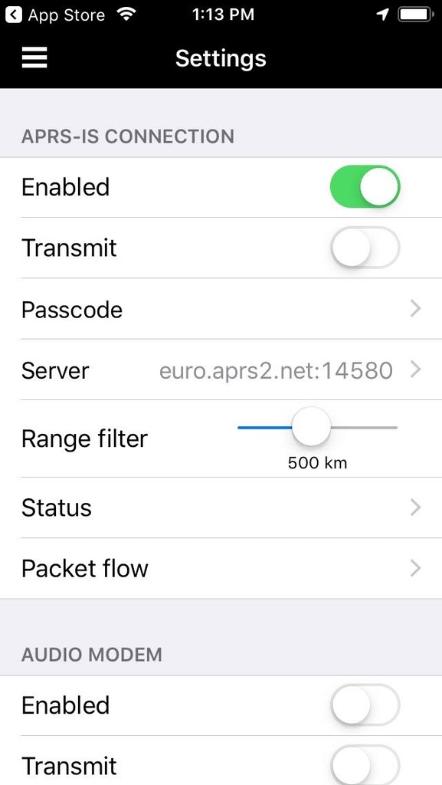

% Setting up APRSdroid or PocketPacket
% Ray Rischpater, KF6GPE kf6gpe@arrl.net | kf6gpe.org  

Go to [tinyurl.com/get-aprs](https://tinyurl.com/get-aprs).

Use The following screens as hints.

# APRSdroid (1 of 3)
 
 

# APRSdroid (2 of 3)

# APRSdroid (3 of 3)

# PocketPacket (1 of 3)
 
 

# PocketPacket (2 of 3)

# PocketPacket (2 of 2)

